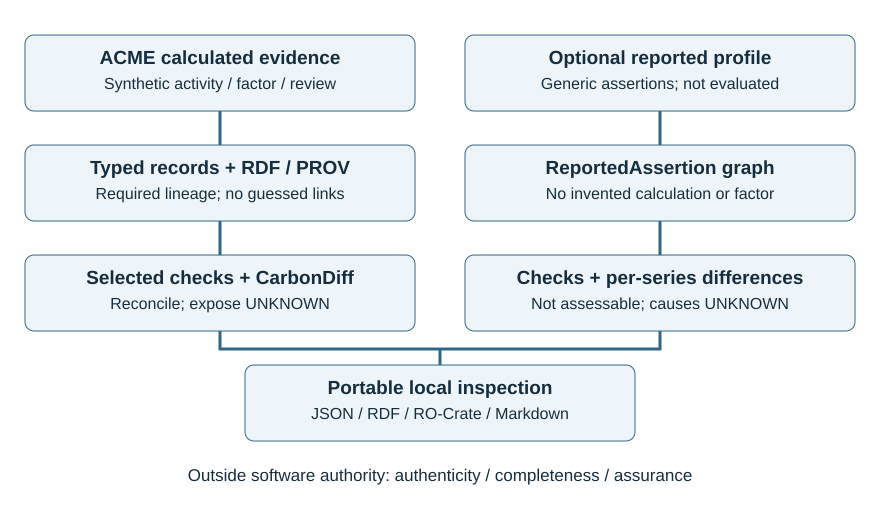
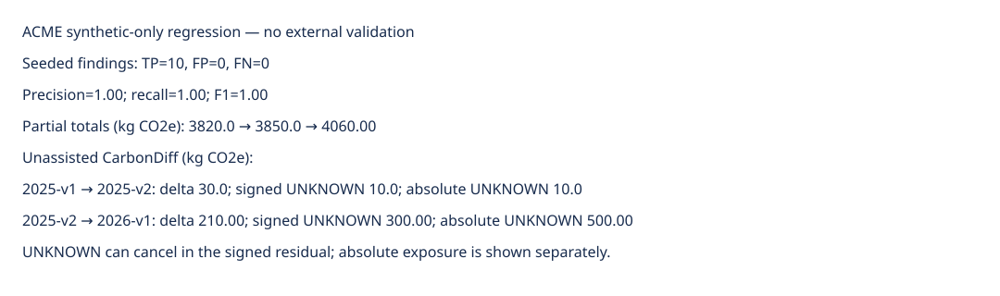

# GHG Assurance Graph: Inspectable provenance and bounded comparison of organizational emissions

**Initial manuscript — 28 September 2026. Qualified alpha 0.4.0a1. Not submitted or human-approved.**

Authors, affiliations, postal addresses and corresponding-author email: **pending owner confirmation**. No authorship or institutional endorsement is inferred from repository ownership.

## Abstract

GHG Assurance Graph is an offline Python library for inspecting organizational greenhouse-gas evidence without confusing reported totals with reconstructed calculations. Typed records, RDF provenance, selected executable constraints, bounded version comparison and portable evidence packages support reproducible review. A synthetic benchmark resolves 45 result lineages and detects ten seeded defects; annotation-assisted comparison reconciles nine expected components. These are public, nonblind regression results, not autonomous causal accuracy. Three fictional ACME snapshots total 3,820, 3,850 and 4,060 kgCO2e, with differences +30 and +210. Validation is synthetic-only. The software exposes missing evidence rather than manufacturing assurance, completeness or standards conformity.

**Keywords:** greenhouse gases; provenance; SHACL; reproducibility; change attribution; evidence graphs

## Software metadata

| Nr | Code metadata description | Metadata |
|---|---|---|
| C1 | Current code version | 0.4.0a1, qualified alpha |
| C2 | Permanent link to code/repository used for this code version | Pending immutable release link; working repository https://github.com/simon5530/ghg-assurance-graph |
| C3 | Legal code license | MIT; upstream dependencies retain their licenses |
| C4 | Code versioning system used | Git |
| C5 | Software code languages, tools and services used | Python; local CLI/library; no hosted service required |
| C6 | Compilation requirements, operating environments and dependencies | Python 3.12; local Python 3.12.14 on macOS arm64; current-release hosted reproduction pending; uv.lock; Pydantic, Pint, RDFLib, pySHACL 0.31.0, RO-Crate 0.15.1; package verification requires POSIX facilities |
| C7 | If available, link to developer documentation/manual | https://github.com/simon5530/ghg-assurance-graph/tree/main/docs (mutable; release permalink pending) |
| C8 | Support email for questions | Owner must provide an approved email; interim support through repository issues |

## 1. Motivation and significance

Organizational greenhouse-gas inventories combine activity evidence, emission factors, characterization conventions, boundaries and review decisions. A plausible total does not identify these dependencies. A year-to-year decrease may reflect changed activity, a corrected input, a different factor or a reporting-boundary change. Researchers need to inspect those alternatives before interpreting a numerical trend. The GHG Protocol Corporate Standard, Scope 2 Guidance and Scope 3 Standard define distinct accounting contexts [1–3]; a software check cannot substitute for establishing their applicability.

GHG Assurance Graph addresses a narrower problem: preserving inspectable evidence relationships, executing selected consistency checks and displaying what a comparison cannot explain. A researcher supplies local structured records, runs a command-line workflow, examines findings and exports a portable evidence directory. Two input profiles prevent an important category error. Calculated results require declared calculation lineage; optional reported totals remain attributed assertions when that lineage is unavailable. Neither profile supplies an independent assurance opinion.

Existing infrastructure is reused rather than reimplemented. PROV-O represents provenance, SHACL supplies graph constraints, and RO-Crate describes portable research objects [4–6]. TEC Toolkit already combines carbon ontologies, PROV-based calculation provenance and executable validation [7]. CarbonLedger implements factor-vintage restatement [8]. Consequently, neither carbon provenance nor numerical factor-change attribution is claimed as new. The contribution is an experimental organizational-GHG integration with explicit authority boundaries, conservative missing-evidence behavior and reproducible examples. No comparative superiority has been measured; the repository's scoped GO rests on a same-case primary-source comparison of the remaining organizational integration contract, not universal novelty or practitioner endorsement.

## 2. Software description

### 2.1. Architecture and implementation

The implementation separates ingestion, canonical records, graph construction, validation, comparison and export (Figure 1). Pydantic rejects unknown fields and invalid references; Pint checks supported physical dimensions. RDFLib constructs collision-checked graphs and executes five allowlisted query templates. pySHACL runs packaged Core shapes with imports, advanced rules, JavaScript and inference disabled. Calculation and comparison do not require a language model, cloud credential, database or web service. Evidence URLs remain inert citations rather than instructions or automatically fetched inputs.

**Figure 1.** Implemented local workflows. Calculated evidence and reported assertions share inspection and export operations but not evidentiary status. Human source interpretation and assurance remain outside the computational boundary. Original schematic generated by the accompanying deterministic Python script; AI assisted its code and explanatory design. No source-report or standards artwork is reproduced.

The canonical schema has 17 record types covering organizations, facilities, periods, inventory versions, sources, activities, evidence, factors, GWP sets, methods, runs, results, boundaries, quality, reviews, changes and findings. Logical identifiers are distinct from revision identifiers. Conflicting content under one revision is rejected; no fuzzy identity matching silently joins inventories. Results link to generating calculations, calculations to used inputs, and reviews to reviewed targets. A retrospective review is not represented as generating the emissions result.

Calculated packages require explicit factor, method, GWP and boundary context. The bounded profile supports one activity and factor per run, not arbitrary multi-input life-cycle models. Generic JSON/CSV interchange accepts caller-mapped external results with complete provenance; it is not a tested PACT, openLCA or Brightway integration. Graph-derived Markdown provides an optional Obsidian inspection view without making Obsidian the database.

### 2.2. Validation and optional reported assertions

Validation combines closed schemas, reference integrity, selected SHACL constraints and independent raw-row domain rules. Findings have stable identifiers and explicit rule/target/severity fields. Checks include factor provenance, supported units, review metadata and arithmetic consistency. Raw decimal strings are checked using exact rational arithmetic, independently of the benchmark calculator. Some restrictions, such as the ACME factor-year policy, are deliberately narrower than accounting standards and must not be mistaken for universal requirements.

An optional generic reported-disclosure/1 profile, outside the empirical evaluation here, stores organization, year, scope/category, Scope 2 basis, decimal-string quantity, source URL/hash/page/retrieval time and explicit boundary, GWP, restatement and rounding metadata. Unknown metadata remains null. A ReportedAssertion does not become an EmissionResult, ActivityRecord or CalculationRun. Validation distinguishes assessed, invalid and not_assessable; the last is neither a defect nor a pass. Report-wide status remains not_assessable because totals alone cannot establish source authenticity, upstream recalculation or independent assurance.

Scope 2 location-based and market-based values are alternatives, never additive. Totals and their components are also not blindly summed. Reported-profile comparisons match explicit series and report arithmetic deltas separately from comparability. Missing years are missing, not zero. Where a total reconciliation is eligible, the tolerance uses disclosed rounding increments; an absent increment is not replaced with an invented tolerance.

### 2.3. CarbonDiff

CarbonDiff compares validated ACME raw snapshots through asserted namespace and stable row identifiers. For activity q, unallocated factor f and allocation share s, its ordered decomposition is:

- Activity component: (q1 − q0) × f0 × s0.
- Factor component: q1 × (f1 − f0) × s0.
- Allocation component: q1 × f1 × (s1 − s0).

Interaction terms therefore belong to later operands. This is an explicit accounting convention, not uniquely identified causation. Bounded Decimal arithmetic isolates precision from the caller's context and enforces exact reconciliation: attributed change plus signed UNKNOWN residual equals the difference in totals. Absolute UNKNOWN exposure is reported separately so opposing unexplained changes cannot disappear through cancellation.

Unsupported substantive changes make the row's delta UNKNOWN unless a caller supplies a scoped semantic declaration covering the observed changes. Declarations contain evidence text and a label, not an expected amount. They are assertions requiring review, not authenticated causal evidence. Changed method, GWP or allocation policy must not silently become operational improvement. The synthetic calculator rejects unsupported market-based electricity, raw-gas characterization, offsets, removals and biogenic streams instead of manufacturing values; this refusal is a scope limit, not implementation of those accounting methods.

### 2.4. Portable evidence and reproducibility

The RO-Crate-based export contains canonical JSON, Turtle, JSON-LD, schema, vocabulary descriptor, metadata and a closed manifest. Explicit timestamps, software versions and commands support replay. Verification checks file membership, hashes, canonical payloads and regenerated exports without dereferencing remote contexts. Unexpected files, symlinks and inconsistent payloads are rejected. This verifies a bounded application profile, not every possible RO-Crate. A separately retained manifest digest can anchor integrity, but hashes alone do not authenticate an invoice, factor or assurance statement.

## 3. Illustrative examples

### 3.1. Synthetic ACME workflow

ACME Electronics is a fictional three-site organizational scenario, not a complete corporate inventory. Version 0.1 supplies three snapshots (2025-v1, 2025-v2, 2026-v1), each with 158 canonical records and 15 results. Factors and characterization bases are invented and nonproduction. Selected Scope 3 sources are included; omitted applicable categories are not declared immaterial. The fixed seed is 20250926, and literal expected values plus a separate Fraction oracle check calculations.

From a locked installation, the principal commands are:

~~~sh
uv sync --locked
uv run ghgag benchmark run
uv run python scripts/run_acme_example.py --out /tmp/acme-paper-example
uv run ghgag graph explain urn:ghgag:acme-2025-v1-electricity-result:v1 --input benchmark/generated/2025-v1
uv run pytest -q
~~~

The electricity explanation resolves a 500 kgCO2e result to its activity/evidence, factor, method, GWP, inventory, period, boundary and simulated review. Across the three clean snapshots, 45/45 required lineage chains resolve. This measures stored relationships, not whether underlying documents exist or tell the truth.

The partial totals are 3,820, 3,850 and 4,060 kgCO2e. Ten separate defective fixtures produce TP=10, FP=0 and FN=0, hence precision, recall and F1 of 1.0. Development and publicly visible holdout subsets contain six and four defects respectively; three clean snapshots have no findings. Defects include duplicate activity, missing factor source, unsupported conversion and double GWP application. Because labels and scenarios are public and informed development, these scores are nonblind regression evidence, not estimates of unseen-inventory performance.

Annotation-assisted comparison reproduces nine expected component labels and amounts exactly, with zero mean absolute component error and zero residual. The restatement consists of a fleet correction (+20) and resolved travel data (+10). The next-year components are electricity activity (−100), electricity factor (+80), supplier mix (−100), method (−50), GWP (+400), boundary (+30) and allocation (−50), all kgCO2e, summing to +210. Seven semantic labels are supplied assertions; only the two electricity components are mechanically decomposed. Without those declarations, the next-year signed UNKNOWN residual is +300 kgCO2e and absolute UNKNOWN exposure is 500 (Figure 2). Zero assisted residual must not be described as autonomous causal accuracy.

**Figure 2.** Executed ACME selected-defect regression and unassisted differences. The source generator reads committed fixtures and calls the evaluator; public labels are nonblind. Signed and absolute UNKNOWN quantities expose unresolved change rather than measured abatement. Original computational figure, with AI-assisted code; no generative image model or third-party artwork.

### 3.2. A detailed inspectable calculation and change example

The electricity row illustrates the full contract. In both 2025 snapshots, activity is 1,000 kWh, the invented precharacterized factor is 0.5 kgCO2e/kWh and allocation share is one: 1,000 × 0.5 × 1 = 500 kgCO2e. The 2026 row uses 800 kWh and 0.6 kgCO2e/kWh, giving 480 kgCO2e. No additional GWP multiplier is applied to a precharacterized factor. Activity-first decomposition gives (800 − 1,000) × 0.5 = −100 and 800 × (0.6 − 0.5) = +80. Their sum is −20, exactly 480 − 500. Reversing the interaction convention would change components, not the total.

The graph explanation links this result to its evidence URI, factor revision, method, GWP basis, inventory version, reporting period, boundary and simulated review. All evidence is invented. A reviewer can inspect relationships and arithmetic, but cannot infer an authenticated electricity bill or an actual organization's emissions reduction.

**Table 1.** Partial synthetic ACME inventory, kgCO2e. Stable identifiers align selected sources, not complete scope totals. Literal expected amounts and a separate Fraction oracle check these values.

| Source | 2025-v1 | 2025-v2 | 2026-v1 |
|---|---:|---:|---:|
| Electricity | 500 | 500 | 480 |
| Natural gas | 200 | 200 | 200 |
| Diesel | 60 | 60 | 60 |
| Fleet | 60 | 80 | 80 |
| Refrigerant | 2000 | 2000 | 2400 |
| Materials | 400 | 400 | 300 |
| Capital goods | 200 | 200 | 200 |
| Transport | 10 | 10 | 10 |
| Waste | 10 | 10 | 10 |
| Travel | 20 | 30 | 30 |
| Commuting | 10 | 10 | 10 |
| Supplier product footprint | 150 | 150 | 150 |
| Method transition | 100 | 100 | 50 |
| Allocation | 100 | 100 | 50 |
| New production line | 0 | 0 | 30 |
| Partial total | 3820 | 3850 | 4060 |

The same-year change is 3,850 − 3,820 = +30; the next-year change is 4,060 − 3,850 = +210. Without semantic declarations, method, characterization-basis and allocation-policy changes leave −50, +400 and −50 unresolved. Their signed sum is +300 while their absolute exposure is 500. Neither is a confidence interval. Bare activity and factor differences remain mechanical components, not inferred explanations such as correction or supplier-mix change. Supplying reviewed scenario declarations resolves the authored labels; it does not authenticate them externally.

The dedicated scripts/run_acme_example.py command above requires an absent or empty output directory. Use --help for its installed-Python override. It reuses the existing benchmark, not a second data set. Its outputs support navigation from snapshot records through graph explanations, selected validation and assisted/unassisted differences to portable evidence. The benchmark and test commands above remain the numerical reproduction oracle; output-file counts are not additional observations.

### 3.3. Verification scope

Executable tests check literal amounts and exact Fraction arithmetic separately from the calculator, 45 required lineage chains, selected seeded defects and assisted component agreement. Adversarial tests cover identity collisions, malformed inputs, precision isolation, unsupported methods, package tampering and denied writes. Regression pass counts describe engineering checks, not scientific performance. The detector does not receive the ground-truth file; the evaluator does. This separation reduces direct answer leakage but does not make development independent or blinded.

The evaluation population is exclusively fictional ACME snapshots and authored negative fixtures. There are no real-company observations, public-report transfer experiments, independent practitioner assessments or measured production adoption. Current-release fresh-machine reproduction and archival identifiers remain pending. Historical release reproduction does not prove this changed release was reproduced externally. Local replay checks software contracts, not source truth, population coverage or causal validity.

## 4. Impact

The immediate utility is methodological transparency: a researcher can ask which factor revision supports a result, which evidence is missing, and whether a numerical change has sufficient context for interpretation. A second use is teaching the distinction between internally consistent data and a substantiated inventory. The optional reported profile is designed to preserve “not assessable” rather than invent missing lineage; that design is not externally validated here.

The software enables future studies of review effort, error discovery and disagreement over attribution conventions. It also supplies a reproducible starting point for comparing an evidence overlay with existing accounting and semantic-provenance tools. Those are prospective uses, not established outcomes. There are no measured independent users, adoption counts, commercial deployments, reductions in review time or publications using this software. Download statistics and repository activity are not substituted for research impact.

Important limitations remain. The model does not implement complete gas-resolved inventories, category-level uncertainty, organizational controls, full significance screening, production recalculation or independently authenticated review. ISO 14064-1:2018 source inspection informs a documented coverage assessment [9]; it does not establish conformity, and ISO categories must not be conflated with GHG Protocol scopes. Scope 2 contractual eligibility is not proved by retaining a market-based number. Synthetic policy restrictions do not become normative requirements. Broader matching, simultaneous semantic causes and vendor-specific adapters require further implementation and validation.

The authority boundary is deliberate: software may expose relationships and reconcile declared quantities, while qualified people must decide source truth, completeness, methodological appropriateness and assurance. Future evaluation should include independently specified cases, practitioner review and external reproduction before stronger claims are made.

## 5. Conclusions

GHG Assurance Graph provides an inspectable, offline evidence workflow connecting typed organizational-GHG records, semantic provenance, selected validation, bounded change comparison and portable outputs. Synthetic-only results demonstrate encoded contracts and unresolved changes; no external validation is claimed. The qualified alpha is a reproducible research artifact, not a certified accounting system or autonomous assurance provider. Human review and stronger impact evidence remain publication-development needs; local replay does not provide those forms of validation.

## Code and data availability

MIT source and synthetic fixtures are available at https://github.com/simon5530/ghg-assurance-graph. This draft describes the 0.4.0a1 working-tree qualified alpha; an immutable release commit, current-release archival identifier and DOI remain pending. Evaluation inputs are benchmark/generated and benchmark/ground_truth, version 0.1, seed 20250926. No company reports, licensed standards text or private evidence are needed for the experiment. Editable figures and the manuscript renderer are included; the PDF is a reading copy, not the official submission format. Historical v0.3 release/archive identifiers do not identify the current code.

## CRediT authorship contribution statement

Pending named authors' approval. Conceptualization, methodology, software, investigation, data curation, validation, visualization and writing roles must be assigned to actual eligible contributors; no assignment or author consent is asserted here. AI systems are not authors.

## Funding

Funding and sponsor involvement require owner confirmation. Neither funding receipt nor absence of funding is asserted.

## Declaration of competing interest

Pending disclosure by every named author. A “no competing interests” declaration has not been authorized.

## Declaration of generative AI and AI-assisted technologies

OpenClaw using openai/gpt-6-astra assisted software, tests, documentation, source inspection, manuscript drafting and deterministic figure-generation code. Earlier standards PDF inspection also used google/gemini-pro-latest, as recorded in the repository AI usage log. No model is required to reproduce the software results. Automated checks do not replace independent human verification. Human authors must review, revise and accept responsibility before submission; that approval has not yet occurred.

## Acknowledgements

No named acknowledgements are included pending permission and owner confirmation.

## References

[1] World Resources Institute and World Business Council for Sustainable Development. The Greenhouse Gas Protocol: A Corporate Accounting and Reporting Standard. Revised edition; 2004. https://ghgprotocol.org/corporate-standard (accessed 26 September 2026).

[2] World Resources Institute. GHG Protocol Scope 2 Guidance. 2015. https://ghgprotocol.org/scope-2-guidance (accessed 26 September 2026).

[3] World Resources Institute and World Business Council for Sustainable Development. Corporate Value Chain (Scope 3) Accounting and Reporting Standard. 2011. https://ghgprotocol.org/corporate-value-chain-scope-3-standard (source PDF inspected 26 September 2026; see source ledger).

[4] W3C. PROV-O: The PROV Ontology. W3C Recommendation, 30 April 2013. https://www.w3.org/TR/prov-o/ (accessed 28 September 2026).

[5] W3C. Shapes Constraint Language (SHACL). W3C Recommendation, 20 July 2017. https://www.w3.org/TR/shacl/ (accessed 28 September 2026).

[6] Research Object community. RO-Crate Metadata Specification, version 1.2. Published 4 June 2025. https://www.researchobject.org/ro-crate/specification/1.2/ (accessed 28 September 2026).

[7] TEC Toolkit. Transparent Emissions Calculation Toolkit; PECO and Data-Validation repositories. https://tec-toolkit.github.io/ (accessed 24 September 2026; inspected repository commits recorded in docs/RELATED_WORK.md).

[8] CarbonLedger project. Carbon-Ledger software, commit ce9f16ed1d987753555d366ceae94e23c81c32b7. https://github.com/jackson-marcus/Carbon-Ledger/tree/ce9f16ed1d987753555d366ceae94e23c81c32b7 (accessed 24 September 2026).

[9] International Organization for Standardization. ISO 14064-1:2018: Greenhouse gases — Part 1: Specification with guidance at the organization level for quantification and reporting of greenhouse gas emissions and removals. Second edition; 2018. https://www.iso.org/standard/66453.html (metadata and bounded licensed-source review recorded 28 September 2026).
